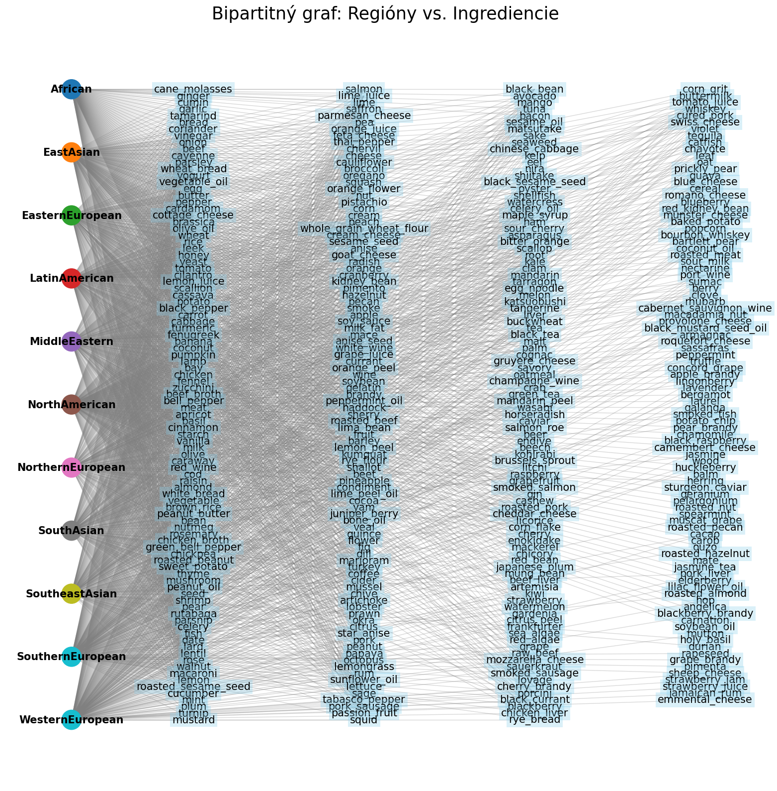
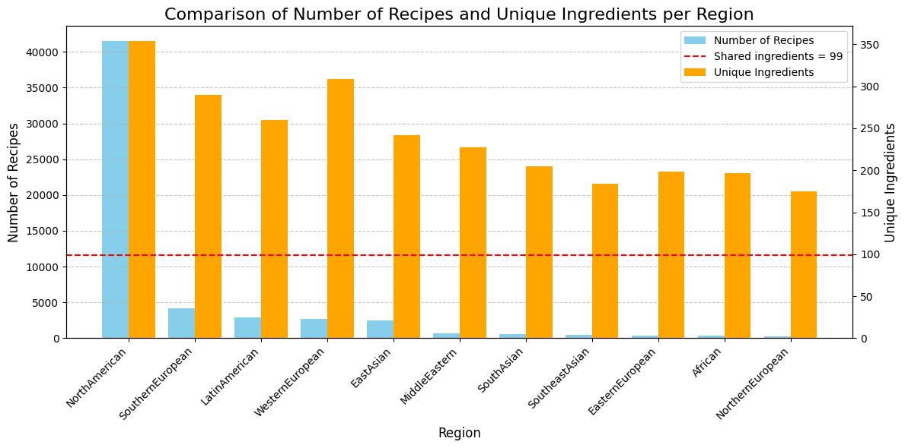
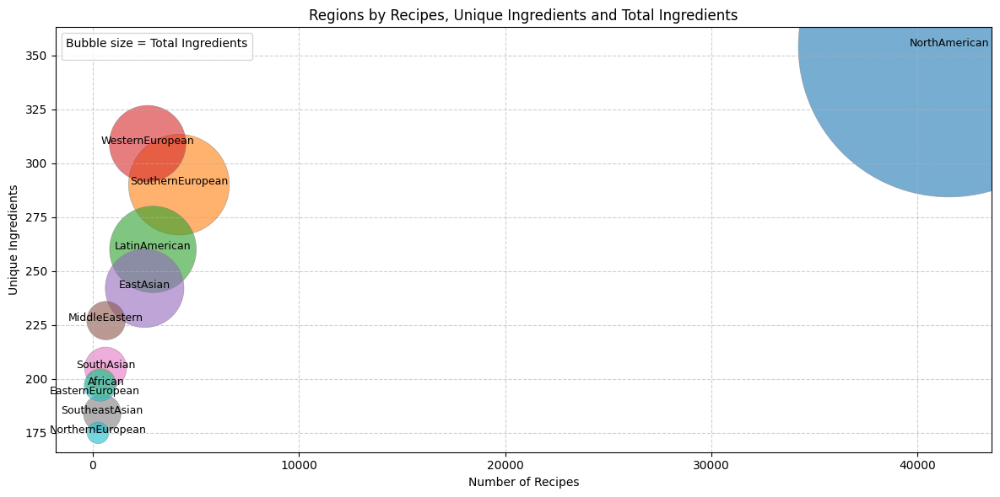
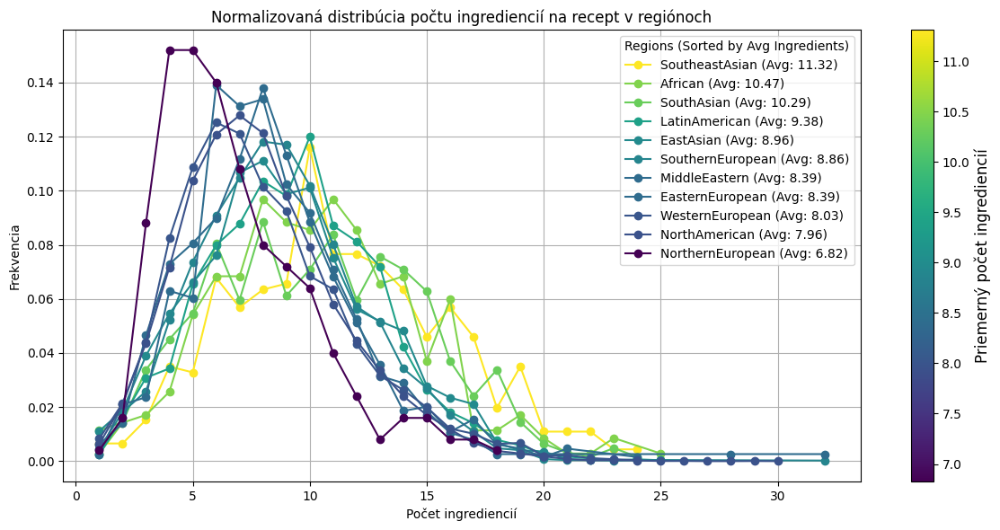
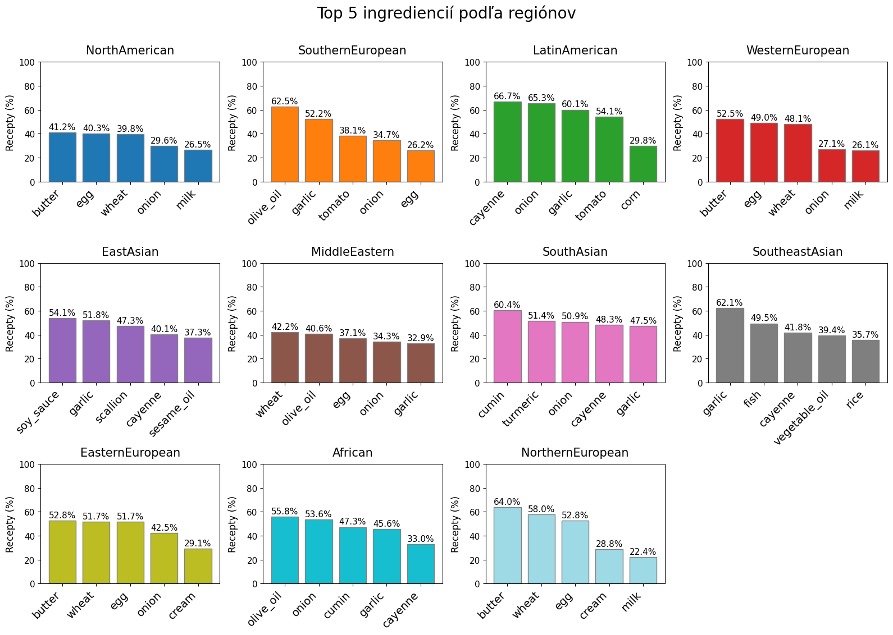
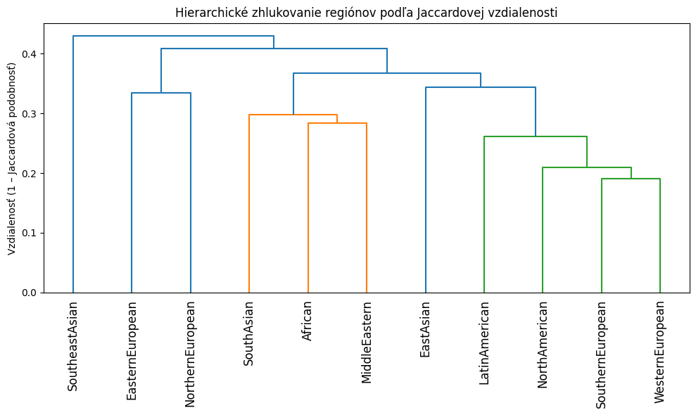
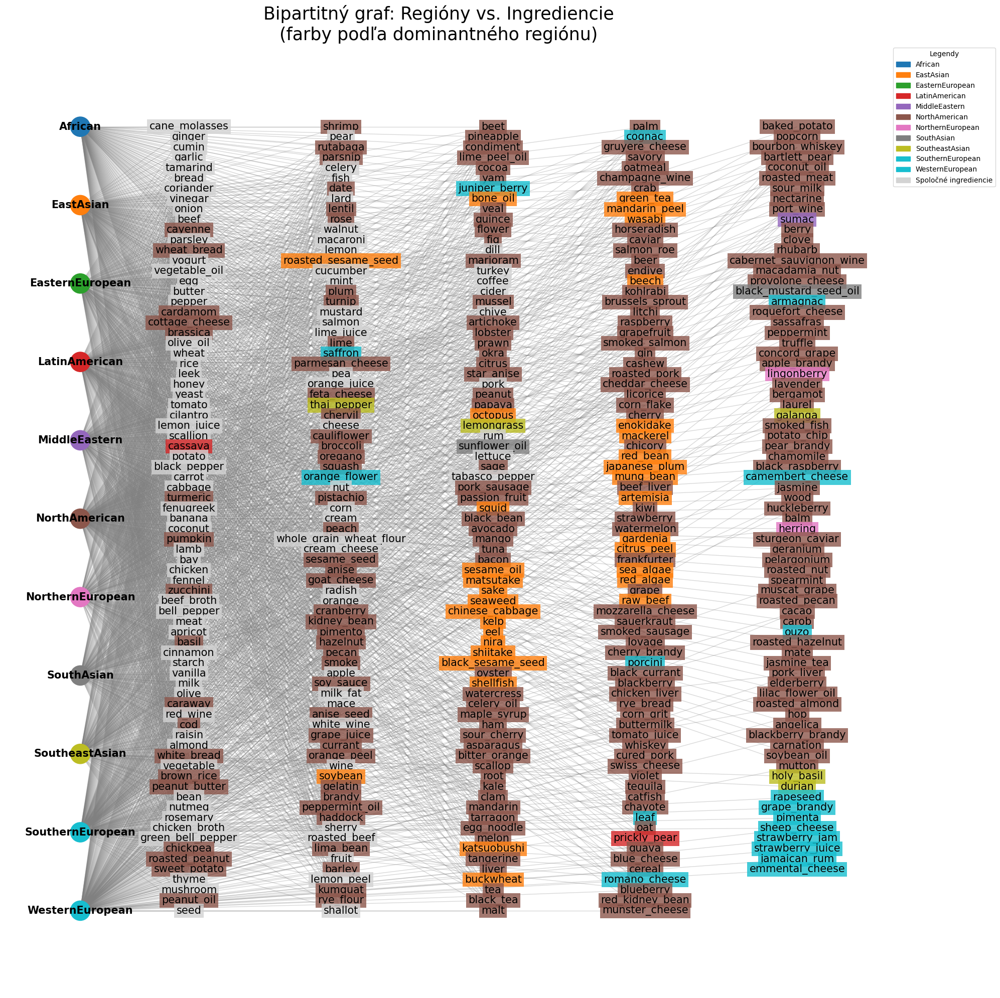
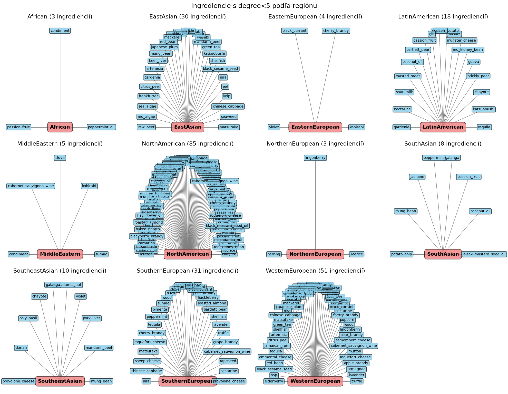
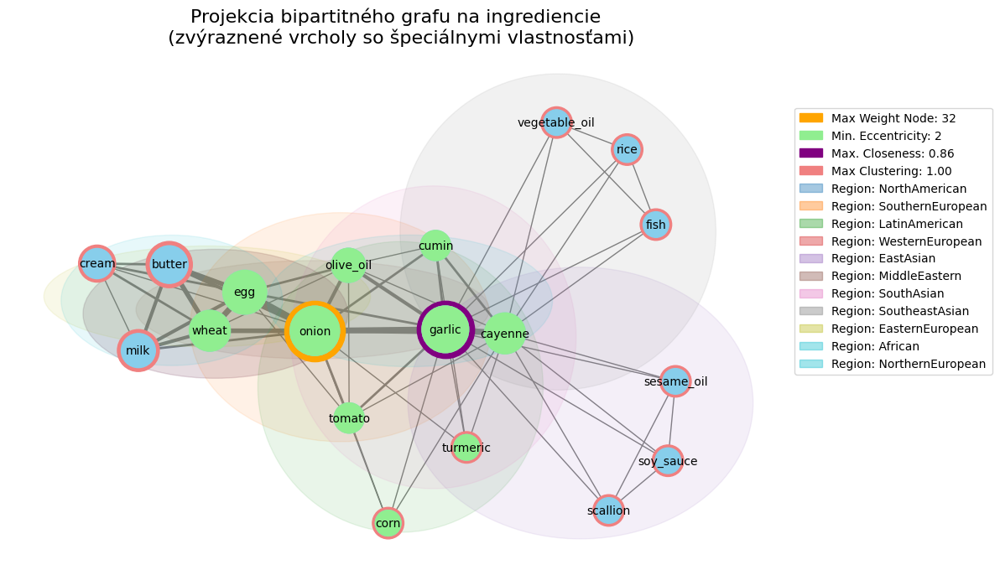
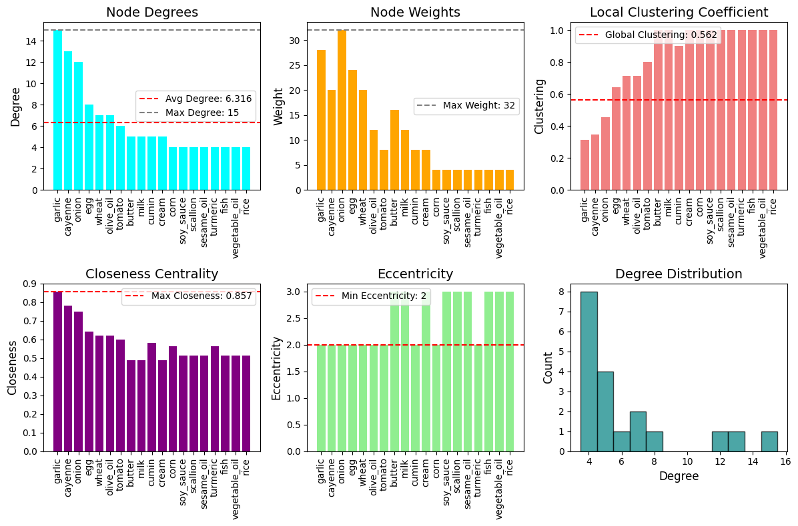

# Unveiling the Kitchen Secrets

---

Semester project for the course Network Science, 3rd year. Group: Galková, Polašková, Bednáriková, Kováčová

---

## Introduction

This project is based on data published in the study "The Cultural Diversity of Culinary Practice" [Yong-Yeol Ahn et al., 2011](https://www.nature.com/articles/srep00196?fbclid=IwZXh0bgNhZW0CMTEAAR5jxK20YaAdsan5F_9OSoRbOx9zHBb7HGKPuMQivwVUcAL6LV9nQuv-Ky7a2g_aem_7pUl6MBiKtyHXnqcm4o6nQ), which investigates patterns in ingredient combinations across different regional cuisines. The study introduces the concept of a "flavor network," capturing shared flavor compounds among ingredients. This approach provides a new perspective on culinary practices and their diversity. From this study, we selected a dataset that provides relationships between ingredients and individual regions.

---

## Data

The dataset allows us to identify which ingredients are globally shared, which are typical for specific regions, and how regions are culinarily interconnected. Thus, it links culture with network analysis.

The data contain a list of recipes in CSV format. The first column represents the region names, while the following columns contain ingredients used in the recipes. We processed the data using `Python` and created the graph using the `NetworkX` library.

Since the relationships are defined exclusively between regions and ingredients, the data can be represented as a bipartite graph. One partition consists of regions, and the other partition consists of ingredients. If an ingredient appears in a recipe from a certain region, it is connected to that region with an edge. The edge weight represents the number of recipes in which the ingredient is used.

### Basic Statistics

| Parameter                                    | Value    |
|---------------------------------------------|----------|
| Total number of nodes                        | 392      |
| Total number of edges                        | 2641     |
| Number of regions (nodes in partition 0)    | 11       |
| Number of ingredients (nodes in partition 1)| 381      |
| Graph density                                | 0.6302   |
| Average degree (Regions - partition 0)      | 240.09   |
| Average degree (Ingredients - partition 1)  | 6.93     |

The bipartite graph shows relationships between regions and ingredients based on the presence of individual ingredients in recipes. On the left, regions are displayed and color-coded (11 regions total). On the right, ingredients (381 total) are arranged in four columns for better readability.

### Statistics by Region

| Region              | Unique Ingredients | Total Ingredients | Number of Recipes |
|--------------------|------------------|-----------------|-----------------|
| African            | 197              | 3674            | 351             |
| EastAsian          | 242              | 22498           | 2512            |
| EasternEuropean    | 198              | 3196            | 381             |
| LatinAmerican      | 260              | 27360           | 2917            |
| MiddleEastern      | 227              | 5411            | 645             |
| NorthAmerican      | 354              | 330618          | 41524           |
| NorthernEuropean   | 175              | 1706            | 250             |
| SouthAsian         | 205              | 6388            | 621             |
| SoutheastAsian     | 184              | 5172            | 457             |
| SouthernEuropean   | 290              | 37038           | 4180            |
| WesternEuropean    | 309              | 21341           | 2659            |

---

## Key Questions

### Question 1: Why does North America use a larger number of ingredients and recipes compared to other regions?

Looking at the bipartite graph and basic statistics of regions and ingredients, it is evident that North America stands out among global regions not only in the number of recipes but also in the diversity of ingredients. The main factors for this diversity are:

- The first reason is cultural diversity due to immigration. North America – mainly the USA and Canada – is a melting pot of immigrants from around the world. Each community brought its traditional recipes, ingredients, and flavor preferences. The result is a culinary fusion where ingredients from Asia, Europe, Latin America, and Africa coexist. This unique cultural mix naturally reflects in the number and variety of ingredients commonly used in the region.
- The second reason may be less strict food regulations. In the USA, the principle is that a substance can be used unless there is evidence of harm (GRAS – generally recognized as safe). Conversely, the European Union applies the precautionary principle, where a substance must be proven safe before approval. This difference does not concern the ingredients themselves, but the chemical compounds they may contain – for example, preservatives, colorings, or sweeteners. Consequently, some ingredients (e.g., certain sweeteners or flavorings) may be restricted or banned in Europe due to their components, while in the USA they are commonly allowed. This can lead to a higher number of distinct ingredients recorded in American recipes. [Time, 2024](https://time.com/7210717/food-additives-us-fda-banned-europe/), [CBS News, 2023](https://www.cbsnews.com/)
- The third factor may be the dataset itself. It is possible that the dataset contains significantly more North American recipes compared to other regions, naturally increasing the recorded number of ingredients in this region. This imbalance could be due to higher digital availability, popularity of American recipes online, or English as the dominant language in available sources.

---

### Question 2: What are the differences in recipes across regions, especially in the number of ingredients per recipe?

The graph shows the normalized distribution of the number of ingredients per recipe across regions. The x-axis represents the number of ingredients per recipe, while the y-axis shows the frequency of that number in the given region. Each curve corresponds to a different region and is colored according to the average number of ingredients in that region.

We observe that Southeast Asian and African regions tend to use a higher average number of ingredients per recipe, with wider distributions and peaks at higher ingredient counts. In contrast, regions such as Northern and Western Europe tend to use fewer ingredients.

---

### Question 3: Which cuisines are similar to each other, and which ingredients are unique to individual cuisines?

From the region–ingredient bipartite graph, we created a weighted one-mode projection on region nodes. The edge between two regions \(r_i,r_j\) has a weight equal to the number of ingredients they share.  

**Jaccard distance** for ingredient sets \(I_i\) and \(I_j\):

$$
d_J(r_i, r_j) = 1 - \frac{|I_i \cap I_j|}{|I_i \cup I_j|}
$$

- \(d_J = 0\) means complete similarity of ingredients.  
- \(d_J = 1\) means complete dissimilarity.  

Hierarchical clustering revealed three natural groups of cuisines.

---

### Question 4: What are the relationships among the top 5 most-used ingredients from each region?

The projection of the bipartite graph onto ingredients shows shared occurrences of the top 5 ingredients across regions.

- Nodes represent ingredients. Node size is proportional to edge weight.  
- An edge between two nodes represents co-occurrence in the same regions. Edge thickness is proportional to the number of regions.

Node color properties:

- **Excentricity (green):** Central ingredients combined with others, e.g., onion, wheat, egg, tomato, olive oil, turmeric.  
- **Closeness centrality (purple):** Garlic has the highest centrality, indicating frequent connections with other ingredients.  
- **Local clustering coefficient (red edges):** e.g., vegetable oil, rice, fish, typical for specific regions.  

---

## Conclusion

- North America stands out for its diversity of recipes and ingredients, reflecting immigration influences and a more liberal approach to additives.  
- Southern Europe and Southeast Asia have characteristic local ingredients and traditional recipes.  
- Regions such as Africa and Asia use the highest number of ingredients per recipe.  
- **Garlic** emerged as the most commonly combined ingredient – serving as a bridge between cuisines.  
- Ingredients like garlic, onion, olive oil, and rice connect most of the world’s cuisines.

---

*Note:* Visualizations were created in Python using NetworkX and are included in the repository.
